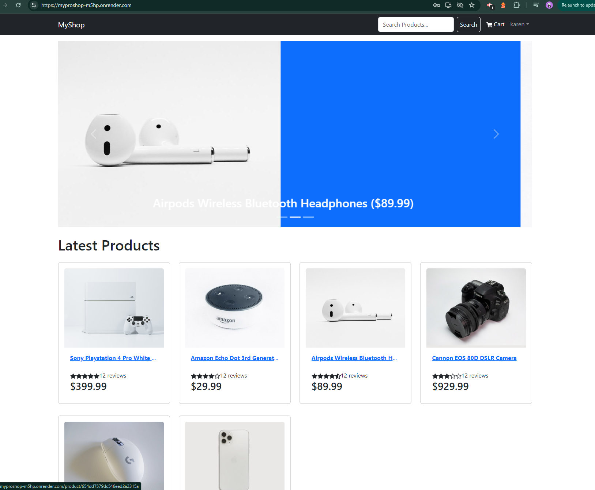
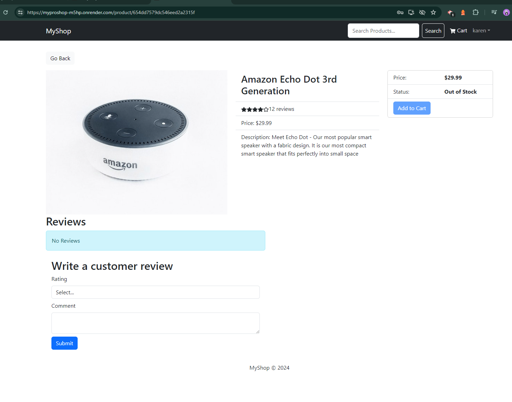
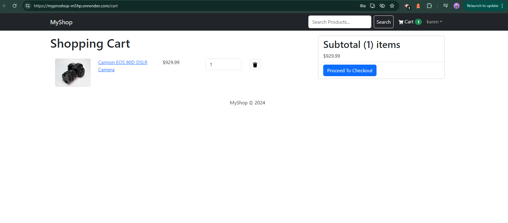
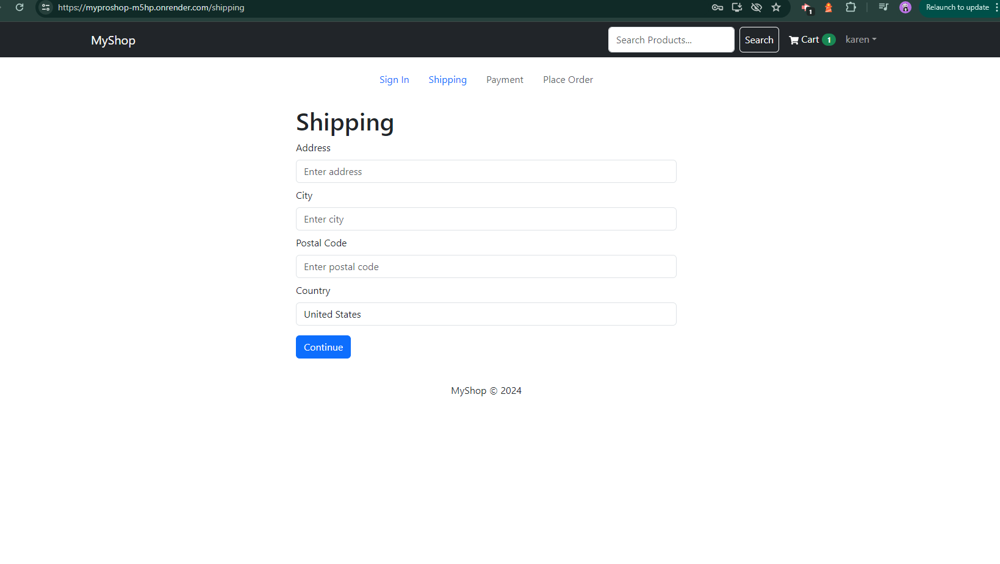
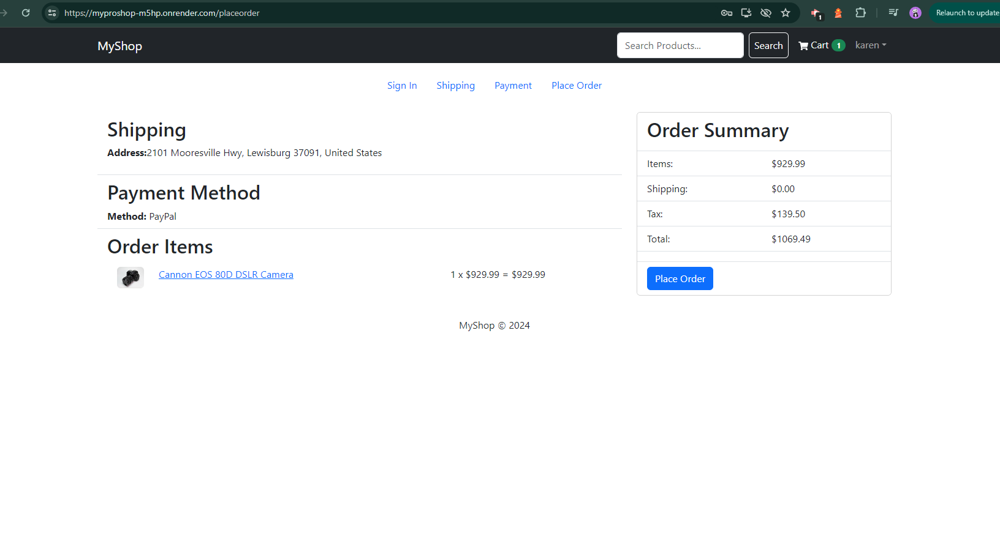
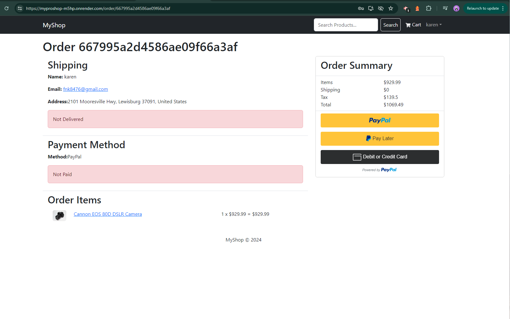
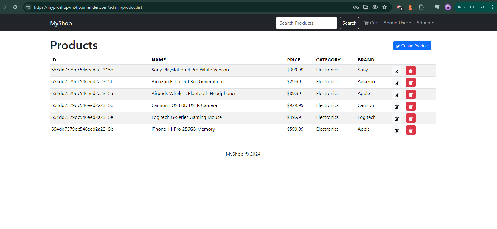
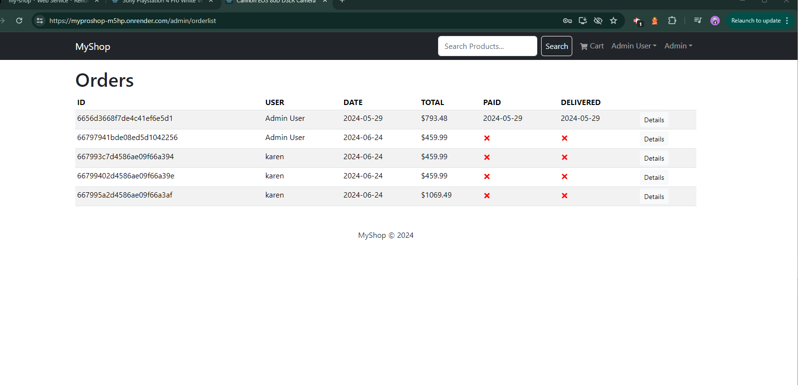
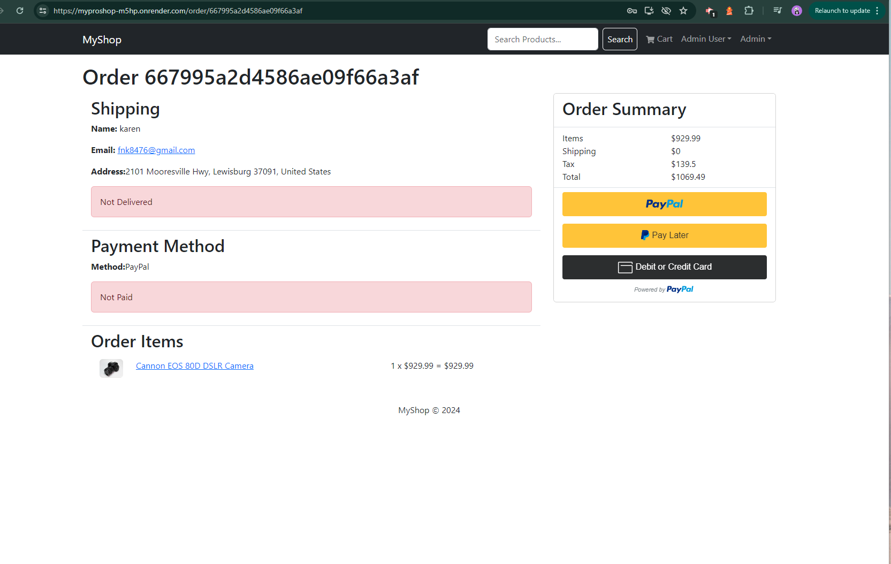

# MyProShop

# Description
An eCommerce platform built with the MERN stack and Redux. It has an admin dashboard that allows you to manage products, orders, and users. It also has a payment gateway that allows you to process payments with Paypal & credit/debit cards. Uses a MongoDB database and a React frontend.

# Table of Contents
* [Screenshots](#screenshots)
* [Deployed Application](#deployed-application)
* [Features](#features)
* [Usage](#usage)
  **[Env Variables](#env-variables)
  **[Install Dependencies](#install-dependencies)
  **[Run](#run)
  **[Build & Deploy](#build-&-deploy)
  **[Seed Database](#seed-database)
* [Credits](#credits)

# Screenshots

# Deployed Application
https://myproshop-m5hp.onrender.com/

# Features
*Full featured shopping cart
*Product reviews and ratings
*Top products carousel
*Product pagination
*Product search feature
*User profile with orders
*Admin product management
*Admin user management
*Admin Order details page
*Mark orders as delivered option
*Checkout process (shipping, payment method, etc)
*PayPal / credit card integration
*Database seeder (products & users)

# Usage
Create a MongoDB database and obtain your MongoDB URI @ https://www.mongodb.com
Create a PayPal account and obtain your Client ID @ PayPal Developer https://developer.paypal.com/docs/integration/paypal-onboarding/ 

### Env Variables
Rename the .env.example file to .env and add the following

NODE_ENV = development ||
PORT = 5000 ||
MONGO_URI = your mongodb uri ||
JWT_SECRET = 'abc123' ||
PAYPAL_CLIENT_ID = your paypal client id ||
PAGINATION_LIMIT = 8 ||
Change the JWT_SECRET and PAGINATION_LIMIT to what you want

### Install Dependencies (frontend & backend)
1.  npm install
2.  cd frontend
3.  npm install

### Run

Run frontend (:3000) & backend (:5000)
npm run dev

Run backend only
npm run server

### Build & Deploy
Create frontend prod build
cd frontend
npm run build

### Seed Database
You can use the following commands to seed the database with some sample users and products as well as destroy all data

Import data
npm run data:import

Destroy data
npm run data:destroy

Sample User Logins

admin@email.com (Admin)
123456

john@email.com (Customer)
123456

jane@email.com (Customer)
123456

## Credits
Karen Adkins, Full-Stack Developer
MERN Stack from Scratch | eCommerce Platform course by Brad Traversy. This course can be found on Udemy and Traversy Media.